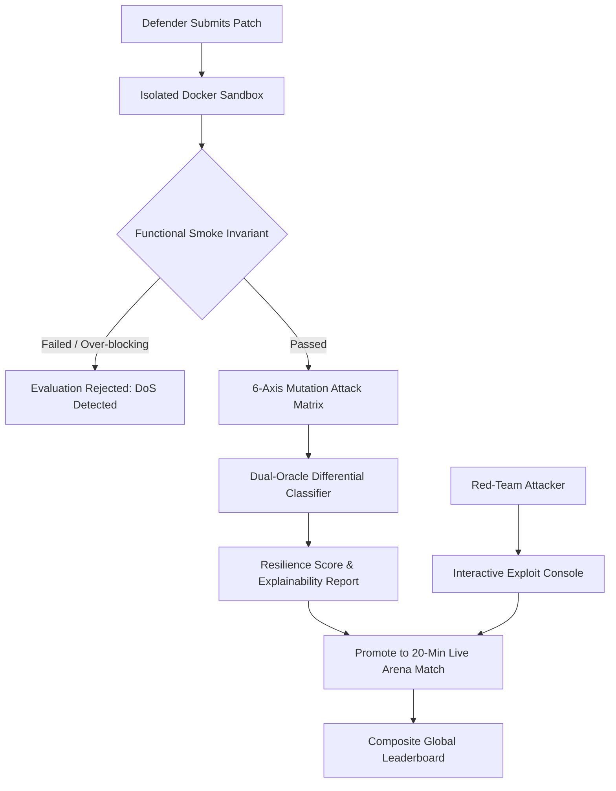
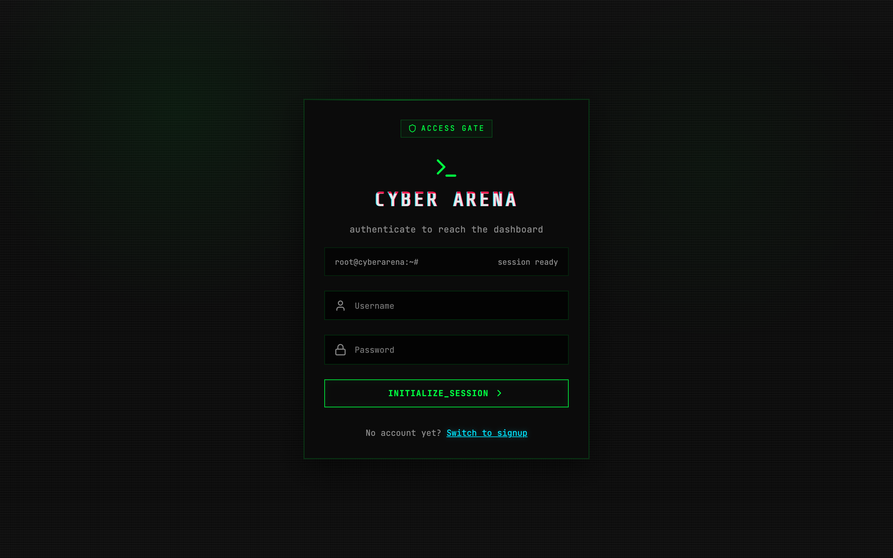
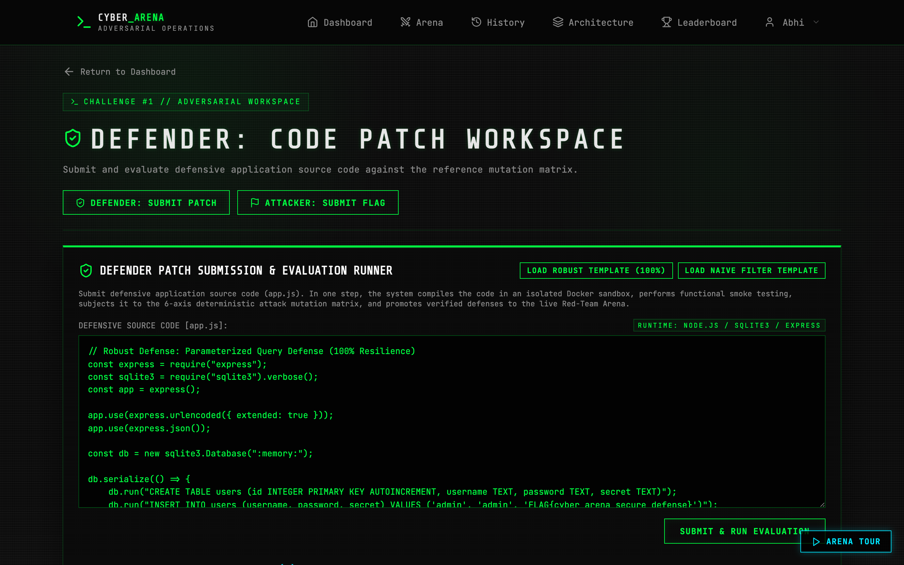
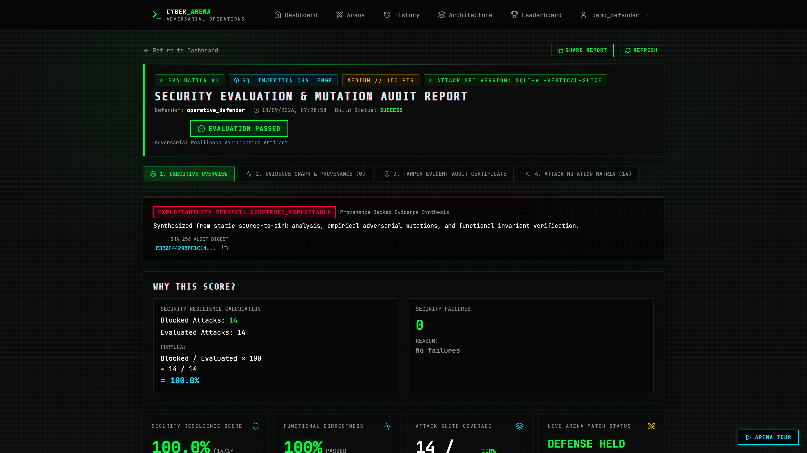
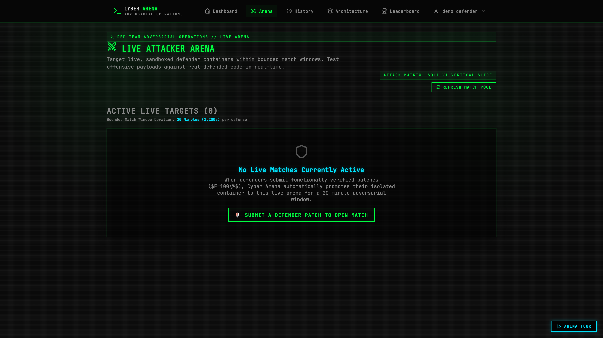
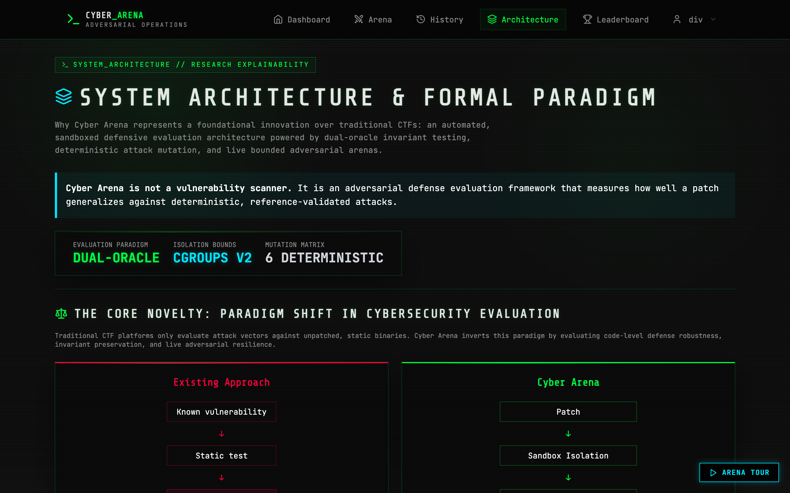
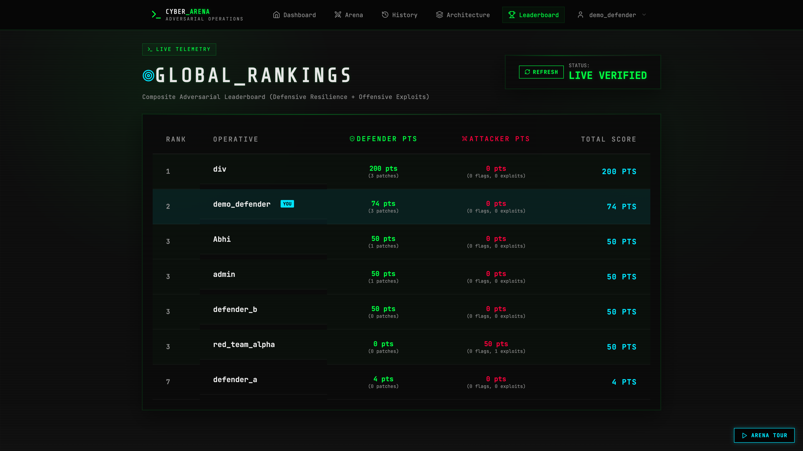
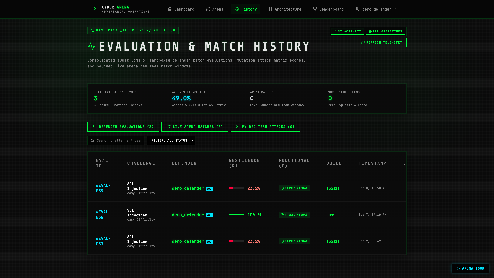

# ⚡ CYBER ARENA
### Automated Adversarial Defense Verification & Bounded Red-Team Platform

 

**An advanced cybersecurity research platform transforming traditional Capture-The-Flag competitions into dynamic defensive invariant verification and live bounded adversarial red-team testing.**

[Overview](#-executive-summary) • [Research Novelty](#-research-novelty--comparative-matrix) • [Architecture](#-high-level-architecture-flow) • [Visual Showcase](#-product-tour--visual-showcase) • [Scoring Foundations](#-formal-scoring-foundations) • [Confidential Access](#-source-code-confidentiality--recruiter-inquiries)

---

 

## 🎯 Executive Summary

Traditional cybersecurity competitions evaluate **only offensive exploitation**: static challenge containers are attacked once, rewards are binary (flag captured or not), and defensive code quality is never verified.

**Cyber Arena bridges this gap by introducing:**
1. **Dynamic Defensive Code Intake**: Defenders submit actual application source code patches to remediate vulnerabilities in real time.
2. **Ephemeral Sandbox Isolation**: Candidate code is compiled and isolated inside strictly bounded Docker environments.
3. **Dual-Oracle Invariant Verification**: Continuous differential validation against an unpatched Reference Oracle to confirm baseline exploitability and verify genuine defense.
4. **Deterministic 6-Axis Mutation Matrix**: Defensive patches are subjected to multi-axis evasion vectors (encodings, case shifts, whitespace variations, comment injections, and differential boolean assertions).
5. **Dual-Dimension Scoring**: Evaluates both **Security Resilience ($R$)** against evasion mutations and **Functional Invariant Correctness ($F$)** to prevent denial-of-service and over-blocking.
6. **Live Bounded Red-Team Arena**: Verified defender containers are promoted into 20-minute adversarial match windows where human attackers probe the live defended system in real time.

---

## 🔬 Research Novelty & Comparative Matrix

| Dimension | Traditional CTF / Cyber Range | **Cyber Arena (This Platform)** |
| :--- | :--- | :--- |
| **Evaluation Focus** | Offensive exploits only | **Adversarial Defense Verification + Live Exploitation** |
| **Challenge State** | Static, pre-compiled, vulnerable | **Dynamic runtime candidate patches** |
| **Defense Verification** | None (no patch submission) | **Automated compilation & testing in isolated sandboxes** |
| **Evasion Testing** | Single static payload test | **Deterministic 6-axis mutation benchmark matrix** |
| **Over-Blocking Prevention** | Ignored (naive regexes pass) | **Functional Invariant ($F$) guarantees legitimate traffic passes** |
| **Attacker-Defender Loop** | Asynchronous / disconnected | **Bounded 20-min Live Arena with real-time target switching** |
| **Scoring Model** | Binary Flag submission | **Composite scoring: Defensive Resilience ($R\%$) + Offensive Exploits** |

---

## 🏛️ High-Level Architecture Flow

---

## 📸 Product Tour & Visual Showcase

### 1. Challenge Command Center & Active Live Targets
> Real-time monitoring of available vulnerable challenge labs and active live defender instances.

---

### 2. Defender IDE & 1-Click Sandbox Evaluation Runner
> Browser code editor with pre-loaded defensive templates, instant Docker sandbox compilation, functional smoke invariants, and automated 6-axis mutation evaluation in a single click.

---

### 3. Faculty Explainability & 6-Axis Mutation Matrix
> Granular audit dashboard breaking down candidate patch resilience across all 6 mutation axes (Encoding, Case Shifts, Comments, Whitespace, Syntax, Differential Boolean Logic) and displaying transparent `DB_ERROR` classification guarantees.

---

### 4. Live Adversarial Red-Team Arena & Payload Forge
> Interactive attacker terminal equipped with categorized attack matrix chips, multi-target defender container switching, high-contrast digital match window countdown (`20m 00s Total`), and instant match conclusion controls.

---

### 5. Research Architecture & Formal Verification Inspector
> Interactive academic explainability interface detailing container isolation guarantees, dual-oracle decision theorems, and mathematical scoring models.

---

### 6. Composite Multi-Dimensional Leaderboard
> Real-time rankings aggregating Defensive Engineering points ($R\% \times \text{Points}$ for verified patches) and Offensive Flag Captures + Arena Breaches.

---

### 7. Historical Audit & Telemetry Log
> Filterable activity audit trail with scoped switching between "My Activity" and "Global Telemetry" feeds.

---

## 📐 Formal Scoring Foundations

### 1. Security Resilience Metric ($R$)
$$\text{Resilience } R = \left( \frac{\text{Blocked Valid Attacks}}{\text{Total Evaluated Mutation Vectors}} \right) \times 100\%$$

### 2. Functional Invariant Metric ($F$)
$$F = \begin{cases} 100\% & \text{if legitimate authentication succeeds (No Over-blocking)} \\ 0\% & \text{if application crashes or denies authentic credentials} \end{cases}$$

### 3. The `DB_ERROR` Security Classification Principle
> In production web application environments, unhandled database errors (e.g. SQL syntax exceptions) reveal internal database schema, enable error-based extraction, and represent unhandled injection state. **Cyber Arena formally classifies all unhandled DB Errors as Security Failures (Attack SUCCESS), preventing superficial regex filters from scoring falsely high.**

---

## 🔒 Multi-Tenant Containment Guarantees

Cyber Arena enforces container-level isolation on all submitted candidate patches:
- **CPU Quota**: Strict core allocation via Linux kernel cgroups.
- **Memory Ceiling**: Strict RAM allocation, preventing host memory exhaustion.
- **Process Limit**: Hard PID limits mitigating fork-bomb vectors.
- **Capability Dropping**: Strips Linux root capabilities (`cap-drop=ALL`).
- **Network Boundaries**: Ephemeral per-evaluation bridge networks with localhost-only port bindings.
- **Autonomous Resource Janitor**: Background garbage collection sweeps the daemon to terminate expired match containers and reclaim resources.

---

## 🛠️ Technology Stack

- **Frontend**: React 18, Vite 5, React Router, Lucide Icons, Pure CSS Glassmorphism Design Tokens.
- **Backend**: Node.js, Express, PostgreSQL 15, Docker Engine Integration, SQLite3 in-memory test harnesses.
- **Security & Sandboxing**: Linux cgroups, ephemeral container bridges, deterministic mutation operators.

---

## 🔐 Source Code Confidentiality & Recruiter Inquiries

> ### ⚠️ Intellectual Property & Research Notice
> The full source code, proprietary mutation heuristics, and automated test harnesses are maintained in a private repository to preserve academic integrity and intellectual property during ongoing capstone evaluation.
>
> ---
>
> ### 💼 For Tech Recruiters, Hiring Managers & Research Evaluators:
> **Full repository access, architecture walk-throughs, and live interactive demo credentials are available upon request.**
>
> If you are considering me for Software Engineering, DevSecOps, or Cybersecurity roles, feel free to reach out directly:
>
> - **👤 Candidate**: **AMIT KUMAR GUPTA**
> - **📧 Email**: [amitgupta150306@gmail.com](mailto:amitgupta150306@gmail.com)
> - **🐙 GitHub**: [@ABHIGH15](https://github.com/ABHIGH15)
>
> *Confidential repository access can be granted within 24 hours via GitHub collaborator invitation.*

---

  Developed as a Research & Engineering Capstone Project • Cyber Arena © 2026

