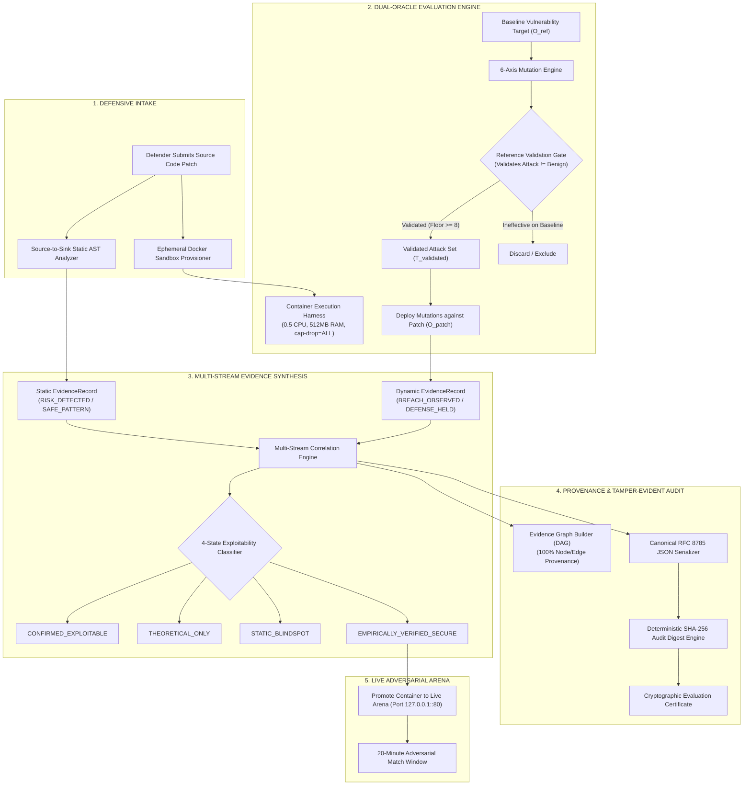

# 🛡️ CYBER ARENA

<div align="center">

### A Reproducible Defensive Security-Patch Evaluation Platform
**via Reference-Validated Adversarial Mutation Testing and Multi-Stream Evidence Correlation**

[](docs/PATENT_AND_SUBMISSION_DOSSIER.md)
[](docs/ARCHITECTURE_OVERVIEW.md)
[](docs/PATENT_AND_SUBMISSION_DOSSIER.md)
[](LICENSE)

<br/>

[](https://nodejs.org/)
[](https://expressjs.com/)
[](https://react.dev/)
[](https://vitejs.dev/)
[](https://www.postgresql.org/)
[](https://www.docker.com/)

<p align="center">
  <a href="#1-executive-overview--the-paradigm-shift">Executive Overview</a> •
  <a href="#2-visual-showcase--platform-walkthrough">Visual Showcase</a> •
  <a href="#3-system-architecture--pipeline">Architecture</a> •
  <a href="#4-core-technical-innovations">Core Innovations</a> •
  <a href="#5-mathematical-foundations">Formulations</a> •
  <a href="#6-automated-verification--invariant-guarantees">Verification</a> •
  <a href="#7-patent--academic-dossier">Patent Dossier</a> •
  <a href="#8-source-code-confidentiality--evaluator-access">Request Code Access</a>
</p>

</div>

---

> [!IMPORTANT]
> **PUBLIC SHOWCASE & RESEARCH PORTFOLIO REPOSITORY**  
> This repository contains the public architecture specification, UI visual demonstrations, formal scoring foundations, and academic patent dossier for **Cyber Arena**. To maintain institutional grading integrity, prevent premature vulnerability disclosure, and safeguard intellectual property during ongoing research review, the live evaluation engine and active target containers are hosted in a private repository.  
> ➔ **Hiring Managers, Evaluators & Security Researchers**: You can request full read-only collaborator access to the core engine [within 24 hours](#8-source-code-confidentiality--evaluator-access).

---

## 📑 Table of Contents

- [1. Executive Overview & The Paradigm Shift](#1-executive-overview--the-paradigm-shift)
  - [The Traditional CTF Dilemma](#the-traditional-ctf-dilemma)
  - [The Cyber Arena Solution](#the-cyber-arena-solution)
  - [Feature Comparison Matrix](#feature-comparison-matrix)
- [2. Visual Showcase & Platform Walkthrough](#2-visual-showcase--platform-walkthrough)
- [3. System Architecture & Pipeline](#3-system-architecture--pipeline)
  - [End-to-End Evaluation Flow](#end-to-end-evaluation-flow)
  - [Container Sandbox Isolation Guarantees](#container-sandbox-isolation-guarantees)
- [4. Core Technical Innovations](#4-core-technical-innovations)
  - [4.1 Reference-Validated Adversarial Mutation Testing](#41-reference-validated-adversarial-mutation-testing)
  - [4.2 Deterministic 6-Axis Mutation Matrix](#42-deterministic-6-axis-mutation-matrix)
  - [4.3 Zero-Tolerance Database & Runtime Exception Invariant](#43-zero-tolerance-database--runtime-exception-invariant)
  - [4.4 Lightweight Advisory AST Source-to-Sink Analysis](#44-lightweight-advisory-ast-source-to-sink-analysis)
  - [4.5 Four-State Multi-Stream Evidence Correlation](#45-four-state-multi-stream-evidence-correlation)
  - [4.6 Directed Acyclic Evidence Graph (DAG) with 100% Provenance](#46-directed-acyclic-evidence-graph-dag-with-100-provenance)
  - [4.7 Canonical JSON Serialization & SHA-256 Audit Digest](#47-canonical-json-serialization--sha-256-audit-digest)
- [5. Mathematical Foundations](#5-mathematical-foundations)
- [6. Automated Verification & Invariant Guarantees](#6-automated-verification--invariant-guarantees)
- [7. Patent & Academic Dossier](#7-patent--academic-dossier)
- [8. Source Code Confidentiality & Evaluator Access](#8-source-code-confidentiality--evaluator-access)
- [9. Repository Structure](#9-repository-structure)
- [10. License & Intellectual Property](#10-license--intellectual-property)

---

## 1. Executive Overview & The Paradigm Shift

### The Traditional CTF Dilemma
Traditional cybersecurity education platforms, Capture-The-Flag (CTF) competitions, and vulnerability evaluation benchmarks operate under a **fundamental structural asymmetry**:
- **Offensive Asymmetry**: They solely evaluate an attacker's capability to exploit a static, intentionally vulnerable binary or container image.
- **Neglected Defensive Engineering**: They provide **no mechanism** to evaluate, grade, or verify source-code patches submitted by defenders.
- **Superficial Fix Vulnerability**: Naive string blacklists or superficial regex sanitizers are often accepted as "fixes" because platforms test with only a single, static exploit payload.
- **Unhandled Error Blindspots**: When patches cause unhandled database or runtime exceptions (`DB_ERROR`), traditional benchmarks misclassify crashes as successful defenses, completely ignoring confidentiality leaks and denial-of-service states.
- **Zero Provenance & Auditability**: Exploit results are recorded as ephemeral console logs with no cryptographic tamper-resistance or causal traceability.

### The Cyber Arena Solution
**Cyber Arena** transforms vulnerability remediation into an **empirical, reproducible, and verifiable science**:
1. **Dynamic Defensive Intake**: Defenders submit real application code patches across major vulnerability classes (**SQL Injection** and **Command Injection**).
2. **Ephemeral Docker Sandbox Isolation**: Each patch is compiled and launched within a strictly isolated, resource-bounded Linux container (`0.5 CPU`, `512MB RAM`, `pids-limit=100`, `cap-drop=ALL`).
3. **Reference-Validated Mutation Engine**: Candidate attack payloads are dynamically transformed across 6 deterministic mutation axes. Crucially, **all mutations are pre-validated against a known-vulnerable baseline reference oracle ($O_{ref}$)** before deployment against the patch ($O_{patch}$).
4. **Dual-Oracle Invariant Verification**: The platform independently measures **Security Resilience ($R$)** against mutating exploits and **Functional Correctness ($F$)** to prevent over-blocking or denial-of-service fixes.
5. **Multi-Stream Evidence Synthesis**: Synthesizes advisory static AST source-to-sink tracking with empirical sandbox telemetry into a **4-state exploitability classification**, backed by a **Directed Acyclic Evidence Graph (DAG)** with **100% provenance** and a **tamper-evident SHA-256 canonical audit digest**.

---

### Feature Comparison Matrix

| Capability Dimension | Traditional CTF / Benchmark Platforms | Cyber Arena Verification Platform |
| :--- | :--- | :--- |
| **Primary Evaluated Role** | Red Team (Attacker exploiting known flaw) | Blue Team / Defender (Remediating source code) |
| **Target Infrastructure** | Static, immutable single-instance image | Ephemeral, resource-bounded Docker sandbox per patch |
| **Scoring Metric** | Binary flag capture ($0$ or $1$) | Dual-Dimension: Security Resilience ($R$) + Functional Correctness ($F$) |
| **Test Vector Generation** | Single fixed payload per challenge | Deterministic 6-Axis Mutation Matrix ($N \ge 8$ per class) |
| **Exploit Pre-Validation** | None (assumes attack payload works) | Dual-Oracle: Offline reference validation on vulnerable baseline |
| **Exception Semantics** | Unhandled SQL/runtime errors treated as safe | **Zero-Tolerance Invariant**: `DB_ERROR` is penalized as security breach |
| **Code Inspection** | None (black-box binary testing) | Intra-procedural AST source-to-sink tracking (advisory signal) |
| **Correlation Model** | Unqualified "Vulnerable" vs. "Patched" | 4-State Empirical Correlation (`CONFIRMED`, `THEORETICAL`, `BLINDSPOT`, `EMPIRICALLY_SECURE`) |
| **Audit & Integrity** | Ephemeral database timestamp | Key-order independent canonical JSON + 64-char SHA-256 digest |
| **Traceability Graph** | None (flat relational tables) | 100% Provenance-backed Directed Acyclic Evidence Graph (DAG) |
| **Live Red-vs-Blue Arena** | Solitary solver activity | Bounded 20-minute live adversarial match against verified container |

---

## 2. Visual Showcase & Platform Walkthrough

The platform features an industry-grade, cyber-themed glassmorphism interface engineered for clarity, sub-second reactivity, and deep explainability.

### 01. Mission Control & Challenge Catalog
> *Real-time telemetry, active evaluation tracking, defense health indicators, and challenge difficulty selection.*


---

### 02. Defender IDE & Patch Submission Engine
> *Interactive in-browser code editor with diff viewing, vulnerability contextualization, and one-click submission to isolated sandbox compilation.*


---

### 03. Deep Explainability Report & Mutation Matrix
> *Granular breakdown of the 6 mutation axes, DB_ERROR zero-tolerance audit indicators, individual attack vector inspect modal, and functional verification status.*


---

### 04. Live Adversarial Attacker Arena
> *20-minute bounded adversarial match window. Red-team attackers launch live manual and automated evasion vectors against defender-hardened containers.*


---

### 05. System Architecture & Pipeline Visualizer
> *Interactive 5-stage pipeline inspector, formal mathematical scoring formulations, and live runtime container isolation verification.*


---

### 06. Composite Leaderboard
> *Multi-dimensional rankings tracking Defender Resilience ($R$), Functional Correctness ($F$), Time to First Blood (TTFB), and Attacker Exploit Success.*


---

### 07. Evaluation & Live Match Ledger
> *Cryptographically verifiable match ledger recording all historical evaluation runs, container lifecycle states, and canonical audit fingerprints.*


---

## 3. System Architecture & Pipeline

### End-to-End Evaluation Flow



### Container Sandbox Isolation Guarantees
Every submitted patch is compiled and evaluated in an ephemeral, resource-fenced Linux container to guarantee evaluation determinism and host security:
- **CPU Quota**: `--cpus=0.5` (Strict CFS scheduler throttling prevents CPU exhaustion).
- **Memory Boundary**: `--memory=512m --memory-swap=512m` (Prevents memory leak or swap thrashing).
- **Process Ceiling**: `--pids-limit=100` (Eliminates fork-bomb denial-of-service attacks).
- **Kernel Capability Stripping**: `--cap-drop=ALL` (Revokes all POSIX root privileges inside container).
- **Network Isolation**: Internal bridge networking with ephemeral loopback port binding (`127.0.0.1::80`).
- **Deterministic Timeout**: 10,000ms hard socket timeout per test vector execution.

---

## 4. Core Technical Innovations

### 4.1 Reference-Validated Adversarial Mutation Testing
A primary vulnerability in software testing is the **invalid test oracle problem**: if an attack vector fails to exploit a patch, is the patch secure, or was the attack vector malformed?
Cyber Arena resolves this with a **Dual-Oracle Architecture**:
1. Every mutated test vector $a_i$ is executed offline against a known-vulnerable baseline reference target ($O_{ref}$).
2. Only mutations that produce a verified breach on the baseline are accepted into the immutable evaluation set $\mathcal{T}_{validated}$:
   $$\mathcal{T}_{validated} = \{ a \in \mathcal{M}(A_{base}) \mid O_{ref}(a) = \text{BREACH} \}$$
3. A strict **Minimum Attack Floor ($N \ge 8$)** is enforced at build time. If an attack set contains fewer than 8 verified vectors, the evaluation pipeline halts immediately with an audit exception.

### 4.2 Deterministic 6-Axis Mutation Matrix
The mutation engine systematically explores evasion techniques using deterministic, reproducible string and AST transformations:

| Mutation Axis | Transformation Operator | Target Evasion Category |
| :--- | :--- | :--- |
| **1. Encoding** | URL (`%27`), Hex (`0x27`), Base64, Unicode normalization | Bypasses naive character-based ingress filters |
| **2. Casing** | Alternating (`sElEcT`, `uNiOn`), Upper/Lower inversions | Evades case-sensitive keyword blacklists |
| **3. Whitespace** | Multi-space, tab insertion (`\t`), inline delimiter substitution | Defeats tokenization parsers and regex word boundaries |
| **4. Comment Injection** | SQL block comments (`SEL/**/ECT`), shell comments (`c$@ad`) | Obfuscates tokens across lexical boundaries |
| **5. Syntax Variation** | Boolean tautologies (`OR 1=1` vs `OR 'a'='a'`), command separators (`;`, `&&`, `|`) | Tests parser resilience against alternate grammar trees |
| **6. Paired Differential** | Paired True/False evaluation (`OR 1=1` vs `OR 1=2`) | Verifies boolean blind and differential data extraction |

### 4.3 Zero-Tolerance Database & Runtime Exception Invariant
A notorious flaw in naive patch grading is rewarding patches that introduce syntax errors or fatal crashes when malicious inputs are supplied:
```text
INVARIANT: Any unhandled database exception (DB_ERROR) or runtime crash
triggered by an input payload constitutes a CONFIDENTIALITY & AVAILABILITY BREACH.
```
- When a patch results in a database syntax error (e.g., unescaped quotes resulting in PostgreSQL error `42601`), the response leaks internal schema structure and violates defense-in-depth.
- Cyber Arena's response evaluator intercepts database error signatures and deterministically classifies them as **Attack `SUCCESS`** (Security Failure). Defenders cannot pass by crashing the server.

### 4.4 Lightweight Advisory AST Source-to-Sink Analysis
The platform features an intra-procedural Abstract Syntax Tree (AST) analyzer that inspects submitted JavaScript/Node.js source code:
- **Source Tracking**: Identifies untrusted input ingress points (`req.body.*`, `req.query.*`, `req.params.*`).
- **Sink Detection**: Tracks dataflow into critical sinks (`db.query()`, `client.query()`, `exec()`, `execSync()`, `spawn()`).
- **Safe Pattern Verification**: Recognizes parameterized queries with explicit binding arrays (`query(sql, [params])`) and separated `execFile(cmd, argsArray)` invocations.
- **Strictly Advisory Role**: Static analysis is intentionally designated as an *advisory signal*. It can never override empirical sandbox breach observations.

### 4.5 Four-State Multi-Stream Evidence Correlation
Cyber Arena synthesizes static and dynamic signals into a definitive 4-state exploitability classification:

```text
                                  STATIC AST SIGNAL
                             RISK_DETECTED    SAFE_PATTERN
                           ┌────────────────┬────────────────┐
            BREACH         │   CONFIRMED    │     STATIC     │
            OBSERVED       │  EXPLOITABLE   │   BLINDSPOT    │
 DYNAMIC                   ├────────────────┼────────────────┤
 TELEMETRY  DEFENSE        │  THEORETICAL   │  EMPIRICALLY   │
            HELD           │     ONLY       │VERIFIED_SECURE │
                           └────────────────┴────────────────┘
```

1. **`CONFIRMED_EXPLOITABLE`**: Static risk pattern detected AND at least one dynamic breach empirically observed in the sandbox.
2. **`THEORETICAL_ONLY`**: Static analyzer flagged a potential risk, but zero dynamic breaches occurred across the validated attack set.
3. **`STATIC_BLINDSPOT`**: Static analyzer passed the code as safe, yet an empirical breach was observed in the sandbox. **Empirical evidence overrules static analysis**, exposing tooling blind spots.
4. **`EMPIRICALLY_VERIFIED_SECURE`**: Recognized safe defensive pattern + 100% resilience across all mutating vectors + 100% functional smoke test pass.
5. **`FUNCTIONAL_REGRESSION_REJECTED`**: Defense held against attacks, but failed legitimate application requests ($F < 100\%$), detecting over-blocking/denial-of-service implementations.

### 4.6 Directed Acyclic Evidence Graph (DAG) with 100% Provenance
To ensure absolute legal and academic explainability:
- Every finding is stored as an immutable `EvidenceRecord` primitive with unique UUID, timestamp, telemetry stream (`STATIC` or `DYNAMIC`), and causal context.
- The `EvidenceGraphBuilder` projects a directed graph where **100% of nodes and causal edges trace back to concrete `EvidenceRecord` IDs**.
- **Zero Phantom Nodes**: Synthetic or inferred nodes without provenance are strictly prohibited by automated invariant checks.

### 4.7 Canonical JSON Serialization & SHA-256 Audit Digest
To provide tamper-evident proof of evaluation integrity:
- Evaluation records are serialized according to **RFC 8785 Canonical JSON** (deterministic key sorting, UTF-8 normalization, whitespace removal).
- A 64-character SHA-256 evaluation digest is computed over the canonical string:
  $$\text{AuditDigest} = \text{SHA256}(\text{CanonicalJSON}(\text{EvaluationRecord}))$$
- Any post-evaluation tampering with security scores, test counts, or diagnostic payloads immediately invalidates the cryptographic certificate digest.

---

## 5. Mathematical Foundations

### 1. Security Resilience Score ($R$)
The Security Resilience score represents the empirical defensive survival rate against reference-validated adversarial mutations:
$$R = \left( \frac{\sum_{i=1}^{N_{eval}} \mathbb{I}(\text{Status}(a_i) = \text{BLOCKED})}{N_{eval}} \right) \times 100\%$$
*Where:*
- $N_{eval}$ is the total number of evaluated attacks (excluding network timeouts / test harness errors).
- $\mathbb{I}(\cdot)$ is the indicator function.
- A single breach drops $R < 100\%$.

### 2. Functional Correctness Invariant ($F$)
To prevent defenders from returning HTTP 403 or dropping connections for all traffic:
$$F = \begin{cases} 
100\%, & \text{if } O_{patch}(\text{legitimate\_admin\_auth}) = \text{HTTP 200 (SUCCESS)} \\
0\%, & \text{otherwise (FUNCTIONAL\_REGRESSION)}
\end{cases}$$

### 3. Error-Penalty Decision Oracle ($\Omega_{sec}$)
Let $S_{resp}$ be the HTTP status code and $B_{resp}$ be the response body. The security evaluation oracle $\Omega_{sec}$ is defined as:
$$\Omega_{sec}(S_{resp}, B_{resp}) = \begin{cases}
\text{SUCCESS (Breach)}, & \text{if } \text{Contains}(B_{resp}, \text{"DB\_ERROR"}) \lor \text{Contains}(B_{resp}, \text{"syntax error"}) \\
\text{SUCCESS (Breach)}, & \text{if } S_{resp} = 200 \land \text{Contains}(B_{resp}, \text{"Welcome Admin"}) \\
\text{BLOCKED (Defended)}, & \text{if } S_{resp} \in \{400, 401, 403\} \lor \text{Contains}(B_{resp}, \text{"Invalid credentials"}) \\
\text{EXCLUDED}, & \text{if connection timeout / network fault}
\end{cases}$$

---

## 6. Automated Verification & Invariant Guarantees

The core engine undergoes automated regression and stress testing against **70+ invariant checks across 5 dedicated test suites**:

| Test Suite | Implementation Scope | Checks | Scope & Guarantees Verified |
| :--- | :--- | :---: | :--- |
| **Suite 1: Infrastructure** | Evaluation Models & Retries | 12 | Domain models, 5 single-axis operators, deduplication, retry policy, exclusion rules |
| **Suite 2: Generic Engine & CMDi** | Command Injection Suite | 11 | CMDi attack set (23 mutations), weak vs robust patch differential resilience, SQLi regression gate |
| **Suite 3: Static & Correlation** | AST & Evidence Synthesis | 14 | Intra-procedural AST source-to-sink tracking, 4 controlled evidence correlation states |
| **Suite 4: Evidence & Audit** | Graph DAG & Digest Engine | 18 | RFC 8785 Canonical JSON determinism, SHA-256 tamper detection, DAG 100% provenance |
| **Suite 5: Adversarial Invariants** | Boundary & Stress Cases | 16 | DB_ERROR zero-tolerance penalty, tamper detection boundaries, empirical authority over static blindspots |
| **TOTAL** | **5 Test Suites** | **71** | **100% Passed • 0 Failed • Zero Regressions** |

---

## 7. Patent & Academic Dossier

The core innovations of Cyber Arena are documented in full formal detail within the Patent & Submission Dossier:
- **Title**: *System, Method, and Computer Program Product for Deterministic Evaluation and Tamper-Evident Certification of Defensive Software Patches Using Multi-Stream Evidence Synthesis*
- **Inventive Concepts**: 7 distinct algorithmic claims covering reference-validated mutations, dual-oracle invariant testing, DB error penalties, 4-state correlation, and provenance DAG projection.
- **Prior Art Analysis**: Comprehensive comparison against OWASP Benchmark, Snyk/SonarQube SAST, AFL/libFuzzer DAST, and traditional CTF architectures.

📖 **Read the Complete Patent Dossier**: [`docs/PATENT_AND_SUBMISSION_DOSSIER.md`](docs/PATENT_AND_SUBMISSION_DOSSIER.md)  
🎮 **Read the Evaluator Demo Playbook**: [`docs/FACULTY_DEMO_PLAYBOOK.md`](docs/FACULTY_DEMO_PLAYBOOK.md)  
🏛️ **Read the Architecture Overview**: [`docs/ARCHITECTURE_OVERVIEW.md`](docs/ARCHITECTURE_OVERVIEW.md)  
🔒 **Read the Security & IP Access Policy**: [`SECURITY_AND_IP.md`](SECURITY_AND_IP.md)

---

## 8. Source Code Confidentiality & Evaluator Access

> ### ⚠️ Intellectual Property & Research Notice
> The full source code, proprietary mutation heuristics, Docker sandbox harnesses, and vulnerability targets are maintained in a private repository to preserve academic integrity and intellectual property during ongoing capstone evaluation.

---

### 💼 For Tech Recruiters, Hiring Managers & Research Evaluators:
**Full repository access, architecture walkthroughs, and live interactive demo credentials are available upon request.**

If you are considering me for Software Engineering, DevSecOps, or Cybersecurity roles, feel free to reach out directly:

- **👤 Author**: **AMIT KUMAR GUPTA**
- **📧 Email**: [amitgupta150306@gmail.com](mailto:amitgupta150306@gmail.com) 
- **🐙 GitHub**: [@ABHIGH15](https://github.com/ABHIGH15)
- **📂 Development Repository**: `ABHIGH15/cyber-arena` *(Private)*

*Confidential read-only repository collaborator access can be granted within 24 hours via GitHub invitation.*

### Academic Citation
```bibtex
@misc{amit2026cyberarena,
  author = {Amit Kumar Gupta},
  title = {Cyber Arena: A Reproducible Security-Patch Evaluation Platform via Reference-Validated Adversarial Mutation Testing and Multi-Stream Evidence Correlation},
  year = {2026},
  publisher = {GitHub},
  howpublished = {\url{https://github.com/ABHIGH15/cyber-arena-showcase}}
}
```

---

## 9. Repository Structure

```text
cyber-arena-showcase/
├── LICENSE                                  # MIT Open-Source License
├── README.md                                # Platform Showcase Master Documentation (This file)
├── SECURITY_AND_IP.md                       # Intellectual property & access request policy
├── docs/                                    # Academic, Patent, and Architecture Dossier
│   ├── ARCHITECTURE_OVERVIEW.md             # Subsystem & containment specifications
│   ├── FACULTY_DEMO_PLAYBOOK.md             # Live evaluation & demonstration runbook
│   └── PATENT_AND_SUBMISSION_DOSSIER.md     # Complete patent claims, proofs & prior art
└── screenshots/                             # High-resolution platform UI assets
    ├── 01_dashboard.png
    ├── 02_defender_submission.png
    ├── 03_explainability_report.png
    ├── 04_attacker_arena.png
    ├── 05_architecture_visualizer.png
    ├── 06_leaderboard.png
    └── 07_match_history.png
```

---

## 10. License & Intellectual Property

This project documentation and public assets are licensed under the **MIT License** - see the [LICENSE](LICENSE) file for details.

```text
Copyright (c) 2026 Amit Kumar Gupta

Permission is hereby granted, free of charge, to any person obtaining a copy
of this software and associated documentation files (the "Software"), to deal
in the Software without restriction, including without limitation the rights
to use, copy, modify, merge, publish, distribute, sublicense, and/or sell
copies of the Software, and to permit persons to whom the Software is
furnished to do so, subject to the following conditions:
...
```

<div align="center">
  <sub>Engineered with precision for verifiable, reproducible cybersecurity defense research.</sub>
</div>
