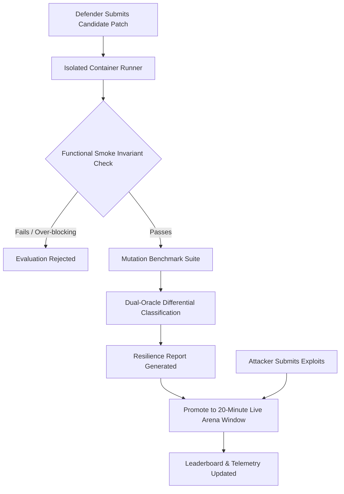

# 🏛️ Cyber Arena System Architecture Overview

> **High-level conceptual overview of the Dual-Oracle Verification Engine, Container Containment Layer, and Bounded Adversarial Arena.**

---

## 1. High-Level System Architecture

Cyber Arena orchestrates four primary decoupled subsystems:

```text
+-------------------------------------------------------------------------------+
|                             CLIENT DASHBOARD LAYER                            |
|             (React 18 + Vite + Custom Cyber Glassmorphism UI)                 |
+---------------------------------------+---------------------------------------+
                                        | (REST APIs / JWT Bearer Auth)
                                        v
+-------------------------------------------------------------------------------+
|                            API & ORCHESTRATION LAYER                          |
|                       (Node.js + Express Framework)                           |
+-------------------+-------------------+-------------------+-------------------+
                    |                   |                   |
                    v                   v                   v
+-----------------------+ +-----------------------+ +---------------------------+
| PERSISTENCE LAYER     | | DUAL-ORACLE ENGINE    | | SANDBOX CONTAINMENT       |
| PostgreSQL Database   | | • Multi-Axis Testing  | | • Strict cgroups CPU cap  |
| • User State          | | • Invariant Oracles   | | • Memory limits           |
| • Telemetry History   | | • DB_ERROR Detection  | | • Linux cap-drop          |
| • Composite Rankings  | | • Smoke Verification  | | • Isolated bridge network |
+-----------------------+ +-----------------------+ +---------------------------+
```

---

## 2. The Verification Lifecycle



---

## 3. The 6-Axis Deterministic Mutation Categories

- **Baseline Fixtures**: Standard canonical injection vectors.
- **Encoding Mutations**: URL and Hex character encoding shifts.
- **Case Variations**: Alternating case keywords to bypass naive substring matches.
- **Whitespace Variations**: Non-standard whitespace token separators and comments.
- **Comment Injections**: Database-specific comment delimiters and multi-line comments.
- **Paired Differential Logic**: Boolean truth/false differential verification pairs.

---

## 4. Multi-Tenant Containment & Security Boundaries

- **Guaranteed Ephemerality**: Every patch evaluation executes in an isolated sandbox environment.
- **Resource Containment**: CPU quotas and memory caps enforced by kernel-level cgroups.
- **Autonomous Resource Janitor**: Background garbage collection reclaims resources and terminates expired match windows automatically.

---

<div align="center">
  <sub>Cyber Arena Technical Overview • Confidential Portfolio Document</sub>
</div>
