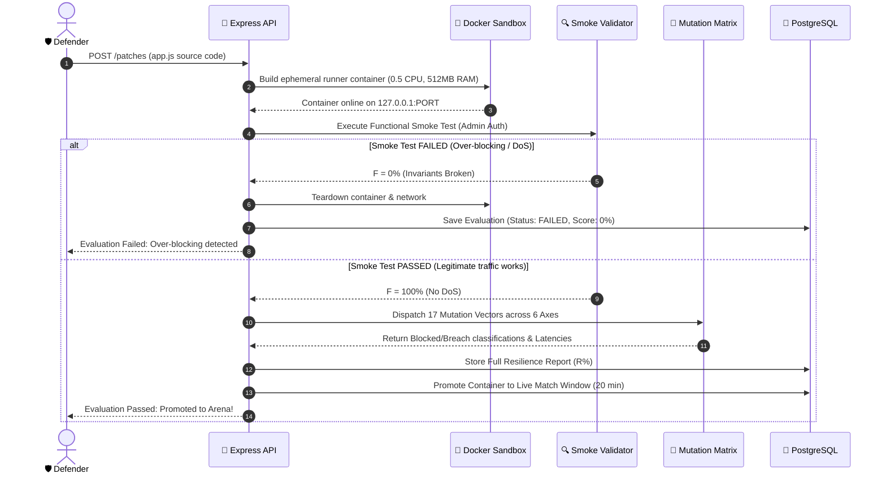

# 🏛️ Cyber Arena System Architecture & Technical Specifications

> **A Deep Technical Overview of the Dual-Oracle Verification Engine, Docker Containment Subsystem, and Bounded Adversarial Live Arena.**

---

## 1. High-Level System Architecture

Cyber Arena orchestrates four decoupled tiers:

```text
+-------------------------------------------------------------------------------+
|                             CLIENT DASHBOARD LAYER                            |
|             (React 18 + Vite 5 + Custom Cyber Glassmorphism System)           |
+---------------------------------------+---------------------------------------+
                                        | (REST APIs / JWT Bearer Auth)
                                        v
+-------------------------------------------------------------------------------+
|                            API & ORCHESTRATION LAYER                          |
|                       (Node.js 24 + Express 5.2 Framework)                    |
|                                                                               |
|  [ Auth Controller ]     [ Patch Controller ]     [ Attack Controller ]       |
|  [ Eval Controller ]     [ Match Manager ]        [ Leaderboard Controller ]  |
+-------------------+-------------------+-------------------+-------------------+
                    |                   |                   |
                    v                   v                   v
+-----------------------+ +-----------------------+ +---------------------------+
| PERSISTENCE LAYER     | | DUAL-ORACLE ENGINE    | | DOCKER RUNNER ISOLATION   |
| PostgreSQL 15         | | • 6-Axis Mutation Set | | • cgroup limits (0.5 CPU) |
| • Users & Sessions    | | • Oracle Classifier   | | • Memory Cap (512MB)      |
| • Match Telemetry     | | • DB_ERROR Invariants | | • Linux cap-drop=ALL      |
| • CTE Score Rankings  | | • Smoke Assertions    | | • Per-eval bridge nets    |
+-----------------------+ +-----------------------+ +---------------------------+
```

---

## 2. The Dual-Oracle Invariant Verification Pipeline



---

## 3. The 6-Axis Deterministic Mutation Matrix

| Mutation Category | Description | Sample Operators |
| :--- | :--- | :--- |
| **1. Baseline Fixtures** | Standard canonical injection vectors | `' OR 1=1 --`, `admin' --` |
| **2. Encoding Mutations** | URL and Hex character encoding variations | `%27%20OR%201=1--`, `%55NION %53ELECT` |
| **3. Case Variations** | Alternating uppercase/lowercase keywords | `admin' oR 1=1 --`, `UnIoN sElEcT` |
| **4. Whitespace Shifts** | Non-standard token separators & tabs | `admin'/**/OR/**/1=1--`, `admin'\tOR\t1=1` |
| **5. Comment Injections** | Alternative database comment syntaxes | `admin' #`, `admin' /* comment */` |
| **6. Paired Differential** | Paired true/false boolean assertions | `admin' AND '1'='1' --` vs `admin' AND '1'='2' --` |

---

## 4. Multi-Tenant Containment & Performance Guarantees

- **Guaranteed Ephemerality**: Every evaluation runs in a freshly built ephemeral container and isolated bridge network.
- **Resource Containment**: CPU quotas and memory caps strictly enforced by the Linux kernel cgroups subsystem.
- **Autonomous Resource Janitor**: Background garbage collection sweeps the Docker daemon every 15 seconds to eliminate container leaks and reclaim memory.

---

<div align="center">
  <sub>Cyber Arena Technical Specifications • Confidential Portfolio Document</sub>
</div>
